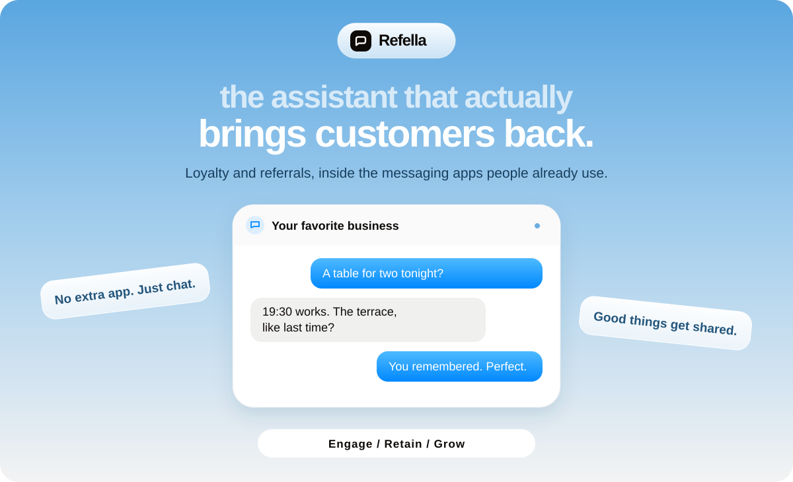
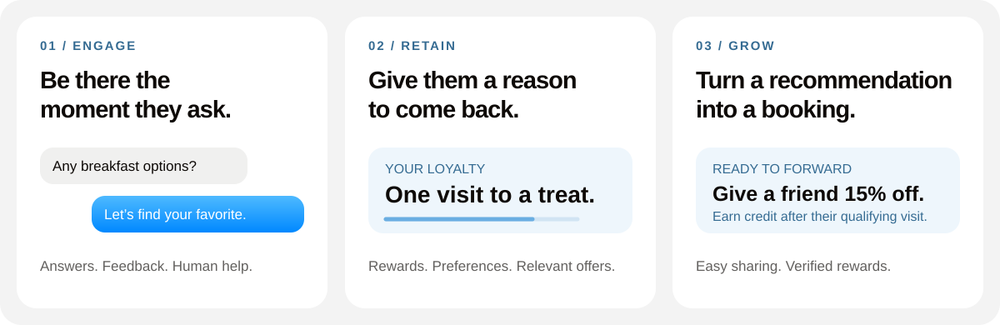

# Refella

**An AI loyalty and referral manager that helps businesses bring customers back and turn recommendations into sales—all through messaging apps.**

[The experience](#one-conversation-the-whole-relationship) · [Referrals](#good-things-get-shared) · [Technical overview](architecture/ARCHITECTURE.md) · [Design system](architecture/DESIGN.md)

**WhatsApp · iMessage · Telegram · Instagram** 
Product channel vision. Availability depends on supported business integrations.

 

## Your next regular is already in a chat.

Customers should be able to ask a question, return for a favorite experience, or recommend a business without installing another app. Businesses should be able to connect those moments to loyalty and sales.

**Refella brings the relationship together:** conversations, preferences, rewards, and introductions—all around one customer profile.

Built for businesses of all sizes, across industries. Restaurants, cafés, retailers, salons, and service providers are a few examples.

> **Build status:** A landing-page implementation has been supplied and reviewed: Next.js, React, TypeScript, and Tailwind CSS, with English/Russian content and scripted chat demonstrations. This repository currently houses the project presentation and documentation. Agent backend code, working channel integrations, and a verified live demo have not been added here. The visuals illustrate the intended experience.

## Three connected capabilities. One conversation.

| Capability | What it brings to the conversation |
| :--- | :--- |
| **Engage** | Answers from approved business information, private feedback, booking or order assistance, staff tipping through a payment flow, and human handoff. |
| **Retain** | Loyalty balances, customer preferences, relevant opted-in offers, and reasons to visit or buy again. |
| **Grow** | Ready-to-forward invitations, personal referral links, help for referred customers, and rewards after qualifying transactions. |

## One conversation. The whole relationship.

**Today — make it easy.** 
Aisha asks for a table for two. Refella checks connected availability and helps her choose the terrace she enjoyed last time.

**Three weeks later — make it personal.** 
With permission, Refella shares a relevant breakfast offer and lets Aisha know she is one visit away from a loyalty reward.

**After a great visit — make it shareable.** 
Aisha receives an invitation she can forward to Dana. Dana starts a conversation, gets answers, and books. After the qualifying visit is verified, Aisha earns credit.

*Illustrative restaurant scenario. The same workflow can support purchases, appointments, and other qualifying business activities.*

## Good things get shared.

The value is closing the gap between **“my friend recommended you”** and **“I booked.”**

| Step | How Refella helps |
| :--- | :--- |
| **01 · Ask at the right moment** | “Give a friend 15% off their first visit, and get credit toward your next one.” |
| **02 · Make sharing easy** | Give the customer a short, ready-to-forward message with a personal referral link. |
| **03 · Welcome the friend** | Preserve the introduction when the friend opens the invitation and starts a chat. |
| **04 · Help them decide** | Answer questions, check connected availability, and support booking or purchase, with staff handoff when needed. |
| **05 · Reward the outcome** | Verify the qualifying transaction, issue the reward once, and record attributed revenue. |

The business defines the offer and qualifying rules. A link click alone does not earn a completion-based reward.

## More useful because it knows the context.

A standalone chat can answer a question. Refella is designed to connect the answer to the customer's preferences, the business's current information, their loyalty balance, and the next action.

For the customer, that means less repetition and fewer steps. For the business, it means a visible connection between conversations, repeat business, and referrals.

[Explore the complete customer journey →](architecture/PRODUCT.md)

## Inside the project

| Area | What has been reviewed or specified |
| :--- | :--- |
| **Landing-page stack** | Next.js 16.3.5 · React 19.2.8 · TypeScript 5 · Tailwind CSS 4, as declared in the supplied source. |
| **Landing-page experience** | Responsive sections, English/Russian routing, scripted chat sequences, reduced-motion handling, and WhatsApp contact links. |
| **Visual language** | Sky blue, paper backgrounds, rounded white cards, soft shadows, and blue/gray conversation bubbles. |
| **Agent architecture** | Proposed channel adapters, conversation orchestration, approved information, business integrations, and a reward ledger. |
| **Execution status** | The supplied frontend is a marketing experience. Its scripts do not establish a functioning AI agent or connected booking/payment backend. |

[Architecture and implementation boundaries →](architecture/ARCHITECTURE.md) · [Landing-page source guide →](architecture/LANDING-PAGE.md)

## Meet the team

| Team member | Contribution |
| :--- | :--- |
| **Insar Tungushbayev · Member** | Idea validation, early customer traction, and the landing page designed to convert interested businesses into customers. |
| **Yerdaulet Damir · Lead** | Backend architecture and development, and visuals for the project video. |

*Responsibilities supplied by the team; backend implementation is not yet available in this repository for review.*

## Repository structure

| Folder | Contents |
| :--- | :--- |
| [`architecture/`](architecture/) | Product, technical architecture, design system and roadmap documents |
| [`landing-page/`](landing-page/) | The Next.js landing page — `cd landing-page && npm install && npm run dev` |

## Take a closer look

| Guide | Start here for… |
| :--- | :--- |
| [Product walkthrough](architecture/PRODUCT.md) | Customer flows and a three-minute demo outline |
| [Technical architecture](architecture/ARCHITECTURE.md) | The frontend reviewed and the agent design proposed |
| [Landing-page guide](architecture/LANDING-PAGE.md) | Source structure, configuration, and setup reference |
| [Design system](architecture/DESIGN.md) | The visual identity shared with the landing page |
| [Roadmap](architecture/ROADMAP.md) | The next implementation milestones |
| [Contributing](CONTRIBUTING.md) | Proposing focused changes |

---

**No extra app. Just a better relationship.** 
Refella · Engage · Retain · Grow

