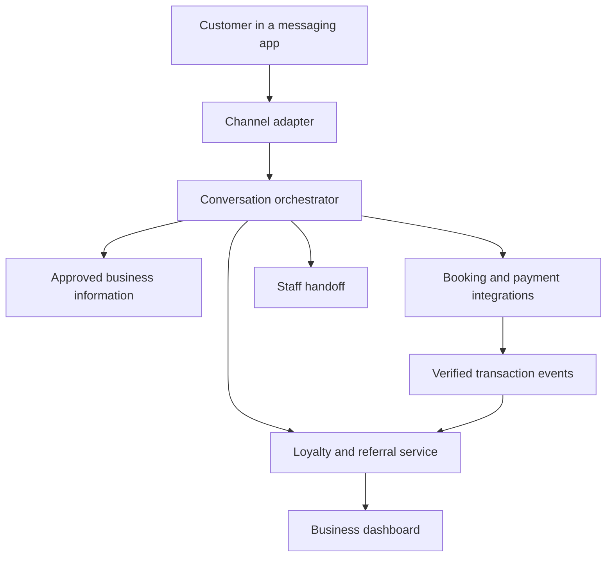

# Technical architecture

[← Back to Refella](../README.md)

## Frontend

The [landing page](../landing-page/) uses **Next.js 16.3.5, React 19.2.8, TypeScript 5, and Tailwind CSS 4**. It includes English/Russian routing, responsive components, scripted chat sequences, and WhatsApp contact links. See the [source guide](LANDING-PAGE.md) for source structure and setup.

## Agent architecture

The system connects messaging, customer context, business actions, and loyalty through a shared event flow.

### System overview

## Responsibilities

| Component | Responsibility |
| --- | --- |
| Channel adapter | Verify inbound events, normalize messages, and respect channel-specific sending rules |
| Conversation orchestrator | Interpret requests, retrieve approved information, and invoke permitted business actions |
| Customer profile | Store business-scoped identity, preferences, consent, and verified channel links |
| Loyalty and referral service | Attribute invitations, enforce qualifying rules, and keep a reward ledger |
| Business integrations | Retrieve current availability or inventory and create supported bookings or payment sessions |
| Event processing | Validate provider callbacks and process each transaction event once |
| Dashboard | Show feedback, activity, referral outcomes, and reward records |
| Staff handoff | Route uncertain answers, disputes, and unsupported actions to a person |

## Core records

| Record | Key information |
| --- | --- |
| Business | Business ID, approved information, program rules, integration references |
| Customer | Business ID, customer ID, channel identities, preferences |
| Consent | Customer, channel, purpose, status, recorded time |
| Referral | Referrer, invitation token, referred customer, attribution status |
| Transaction | Provider reference, business, customer, amount, completion or refund status |
| Reward entry | Customer, qualifying transaction, credit or reversal, reason |
| Feedback | Customer, business, feedback text, staff follow-up status |

## Rules that make outcomes trustworthy

1. Scope customer data and actions to the correct business.
2. Retrieve prices and availability from approved sources; do not guess.
3. Treat customer messages as input, never as permission to change business rules.
4. Apply rewards using deterministic program rules after verified completion.
5. Deduplicate callbacks so a retried event cannot create a second reward.
6. Handle cancellations and refunds through explicit reversal rules.
7. Check promotional consent at send time.
8. Keep API credentials server-side and exclude them from repository files.

## Integration design

Channel adapters normalize messages into a shared conversation workflow. Booking and payment integrations use a common transaction-event contract, keeping provider-specific details separate from loyalty and referral rules.
